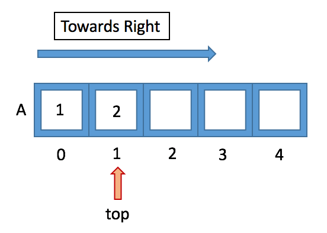
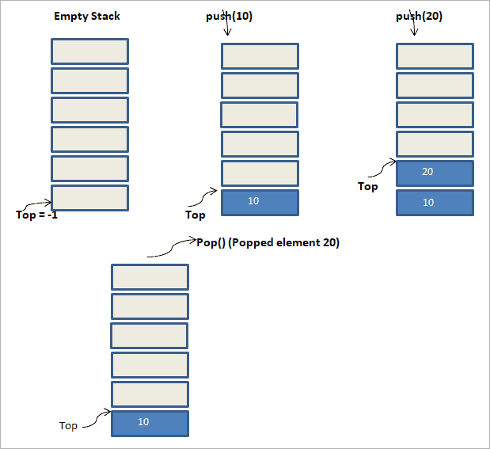

<h2>Project Name:</h2><h3>Make a Progrram using ARRAY STACK</h3>

<h2>Background Study</h2>

<p>As shown above, there is a pile of plates stacked on top of each other. If we want to add another item to it, then we add it at the top of the stack as shown in the above figure (left-hand side). This operation of adding an item to stack is called <b>“Push”</b>.</p>
<p>On the right side, we have shown an opposite operation i.e. we remove an item from the stack. This is also done from the same end i.e. the top of the stack. This operation is called <b>“Pop”</b>.</p>
<p>As shown in the above figure, we see that push and pop are carried out from the same end. This makes the stack to follow LIFO order. The position or end from which the items are pushed in or popped out to/from the stack is called the <b>“Top of the stack”</b>.</p>




<h2>Basic Operations</h2>

```
Following are the basic operations that are supported by the stack.

push – Adds or pushes an element into the stack.   
pop – Removes or pops an element out of the stack.    

peek – Gets the top element of the stack but doesn’t remove it.       

isFull – Tests if the stack is full.
isEmpty – Tests if the stack is empty.
```
Sakib" >

<h2>Operation Details</h2>

```
isempty()- Now that we know that the stack is empty when top is equal to -1 we can use this to implement our isempty() function i.e. when top == -1 retrun true else return false.

push()- To push an element into the stack we will simply increment top by one and insert the element at that position. While inserting we have to take care of the condition when the array is full i.e. when top == SIZE-1;

pop()- To pop an element from the stack we will simple decrement top by one which will simply mean that the element is no longer the part of the stack. In this case we have to take care of the condition when the stack is empty i.e top == -1 then we cannot perform the pop operation.

show_top()- we will simply print the element at top if the stack is not empty.

Lets say we have an stack with one element i.e 2 and we have to insert ot push an element 3 to this stack.

```

<p>Now in the last figure, we perform a pop () operation. As a result of the pop operation, the element pointed at the top of the stack is removed from the stack. Hence in the figure, we see that element 20 is removed from the stack. Thus the top of the stack now points to 10.</p>


<h2>Source Code </h2>

<b> <a href="./code/array_code.cpp">Code File </a>

```cpp
#include <bits/stdc++.h>

using namespace std;
int stacak[100], n = 100, head = -1;
void push_stack(int data)
{
    if (head >= n - 1)
    {
        cout << endl << endl << "\t" << "STACK OVER Flow" << endl << endl;
        return;
    }
    head++;
    stacak[head] = data;
}
void pop()
{
    if (head <= -1)
    {
        cout << endl << endl << "\t" << "STACK UNDER Flow" << endl << endl;
        return;
    }
    cout << "The popped element is " << stacak[head] << endl;
    head--;
}
void display_all()
{
    if (head >= 0)
    {
        cout << endl << endl << "\t" << "Stack elements are: ";
        for (int i = head; i >= 0; i--)
        {
            cout << stacak[i] << " ";
        }
        cout << endl << endl << endl;
    }
    else
        cout << endl << endl << "\t" << "Stack is empty" << endl << endl;
}
void display_top()
{
    if (head >= 0)
    {
        cout << endl << endl << "\t" << "Head of the stack: " << stacak[head] << endl;
    }
    else
    {
        cout << endl << endl << "\t" <<  "Stack is empty" << endl;
    }
}
int main()
{
    // Md. Nazmus Sakib
    /* Enter your code here. Read input from STDIN. Print output to STDOUT */
    int ch;
    while (true)
    {
        cout << endl;
        cout << 1 << " "
             << "PUSH in STACK" << endl;
        cout << 2 << " "
             << "POP in STACK" << endl;
        cout << 3 << " "
             << "PRINT HEAD Element" << endl;
        cout << 4 << " "
             << "PRINT ALL Element" << endl;
        cout << 5 << " "
             << "QUIT" << endl;
        cout << endl
             << endl
             << "Enter select a menue: ";
        cin >> ch;
        switch (ch)
        {
        case 1:
        {
            cout << "Enter a value ";
            int val;
            cin >> val;
            push_stack(val);
            break;
        }
        case 2:
        {
            pop();
            break;
        }
        case 3:
        {
            display_top();
            break;
        }
        case 4:
        {
            display_all();
            break;
        }
        case 5:
        {
            return 0;
        }
        default:
            cout << endl
                 << endl
                 << "You select wrong menue" << endl
                 << endl;
            break;
        }
    }
    return 0;
}

```

<h2>In Sort</h2>

<p>The stack is the simplest data structure and easier to implement as a program. It used the LIFO (last in, first out) approach which means the element entered last is the one that is removed first. This is because stack uses only one end to add (push) and remove (pop) elements.</p>
<p>The stack data structure has many uses in software programming. The prominent one among them is expression evaluations. Expression evaluation also includes converting the expression from infix to postfix or prefix. It also involves evaluating the expression to produce the final result.</p>

| Name         | Link                  |
| ------------ | ---------------------- |
| Md. Nazmus Sakib | BSc In Engr.           |
| Email | engrsakib02@gmail.com |
| Facebook | [Facebook][facebook_link]           |
|  Code Force | [Code Force][Code_force_link] |


[facebook_link]: https://www.facebook.com/engrsakib02/
[code_force_link]: https://codeforces.com/profile/engrsakib
